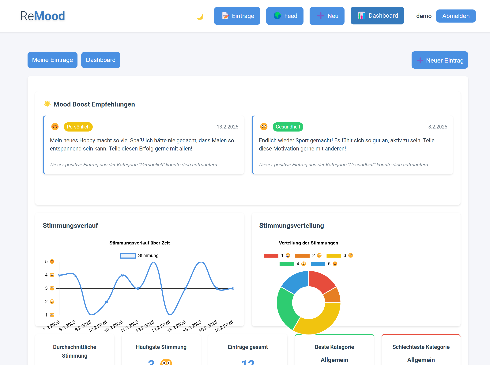

# ReMood - Dein persönlicher Stimmungstracker 🌈

[](https://opensource.org/licenses/MIT)

ReMood ist eine moderne, sichere und benutzerfreundliche Web-Anwendung zum Tracking deiner täglichen Stimmung. Mit einem Fokus auf Privatsphäre und Benutzerfreundlichkeit bietet ReMood eine intuitive Plattform zur Dokumentation und Analyse deiner emotionalen Reise.



## ✨ Features

### 📝 Stimmungstracking

- Tägliche Stimmungsaufzeichnung mit einer 5-Punkte-Skala
- Emoji-basierte Stimmungsvisualisierung
- Kategorisierung der Einträge (Arbeit, Familie, Gesundheit, etc.)
- Optionale Kennzeichnung von Breakdown-Momenten

### 🔒 Datenschutz & Sicherheit

- Ende-zu-Ende-Verschlüsselung für private Einträge
- Sichere Passwort-Hashing mit bcrypt
- Lokale Datenspeicherung in SQLite
- Wahlweise private oder öffentliche Einträge

### 📊 Visualisierung & Analyse

- Interaktive Stimmungsverlaufsgrafiken
- Kategoriebasierte Auswertungen
- Trendanalysen und Statistiken
- Mood-Boost Empfehlungen basierend auf positiven Einträgen

### 🌍 Soziale Features

- Öffentlicher Feed für geteilte Einträge
- Benutzerprofile mit öffentlichen Einträgen
- Teilbare Benutzer-Feeds
- Einfache Benutzersuche

## 🚀 Installation

### Voraussetzungen

- Python 3.8 oder höher
- Node.js 14 oder höher
- uv (Python Paketmanager)

### Setup

1. Repository klonen:

```bash
git clone [repository-url]
cd ReMood
```

2. Python-Abhängigkeiten installieren:

```bash
uv venv
source .venv/bin/activate  # Unter Windows: .venv\\Scripts\\activate
uv pip install -r requirements.txt
```

3. Frontend-Abhängigkeiten installieren:

```bash
cd frontend
npm install
npm run build
```

4. Umgebungsvariablen konfigurieren:

```bash
cp .env.example .env
# Bearbeite .env und setze die erforderlichen Werte
```

5. Anwendung starten:

```bash
python run.py
```

6. Öffne http://localhost:8000 in deinem Browser

## 🛠 Technologie-Stack

### Backend

- **Framework**: FastAPI
- **Datenbank**: SQLite mit SQLAlchemy ORM
- **Authentifizierung**: JWT mit Python-Jose
- **Verschlüsselung**: AES-256 mit cryptography
- **API-Dokumentation**: OpenAPI/Swagger

### Frontend

- **Framework**: Vue.js 3
- **State Management**: Pinia
- **Routing**: Vue Router
- **UI-Komponenten**: Custom Components
- **Grafiken**: Chart.js mit vue-chartjs
- **Styling**: Custom CSS mit CSS Variables

## 📱 Responsive Design

- Optimiert für Desktop und Mobile
- Adaptive Layouts
- Touch-freundliche Bedienelemente
- Responsive Grafiken und Tabellen

## 🔧 Entwicklung

### Backend starten

```bash
python run.py
```

### Frontend Development Server

```bash
cd frontend
npm run dev
```

### Build für Produktion

```bash
cd frontend
npm run build
```

## 🤝 Beitragen

1. Fork das Repository
2. Erstelle einen Feature Branch (`git checkout -b feature/AmazingFeature`)
3. Committe deine Änderungen (`git commit -m 'Add some AmazingFeature'`)
4. Push zu dem Branch (`git push origin feature/AmazingFeature`)
5. Öffne einen Pull Request

## 📄 Lizenz

Dieses Projekt ist unter der MIT-Lizenz lizenziert - siehe die [LICENSE](LICENSE) Datei für Details.

## 🙏 Danksagung

- Alle Mitwirkenden und Unterstützer
- Die Open-Source-Community
- Benutzer, die wertvolles Feedback geben

## 📞 Support

Bei Fragen oder Problemen:

- Erstelle ein Issue im Repository
